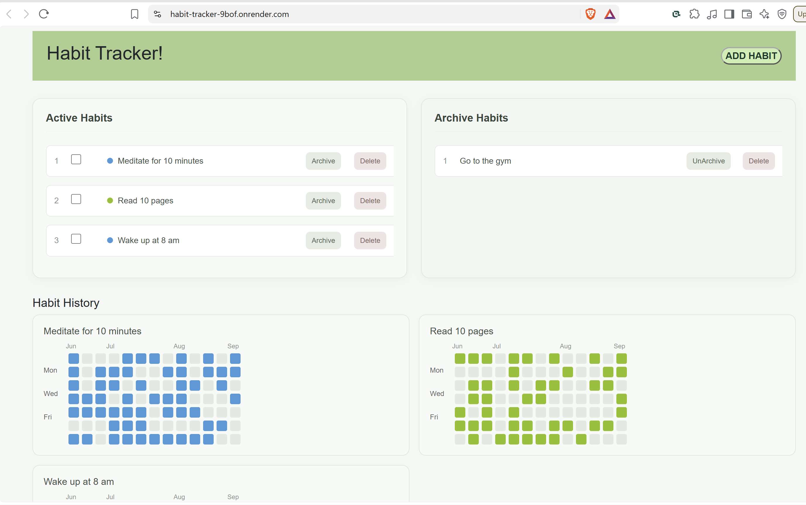

# 🟩 Habit Tracker — Full Stack Application

> A full-stack habit tracking application inspired by GitHub's contribution heatmap.

Track daily habits, visualise your consistency over the last 90 days, and build routines that stick.

## 🚀 Live Project

🌐 **Live Application:** https://habit-tracker-9bof.onrender.com

🎨 **Frontend Repository:** https://github.com/NischalBhatta/ht_client

🖥️ **Backend Repository:** You are here

---

## 📸 Preview




---

## 📌 About the Project

I built this project as a full-stack portfolio project and as a practical application for tracking daily habits.

The idea came from GitHub's contribution heatmap. I wanted to apply the same concept to everyday habits, where each square represents whether a habit was completed on a particular day.

The application allows users to create habits, mark them as completed, archive them, and view their consistency through a 90-day heatmap.

The project is developed across two separate repositories:

- **Frontend:** React + Vite
- **Backend:** Node.js + Express + MongoDB

For production, the React application is built into a static `dist` folder and served directly by the Express backend as part of a single deployed service.

---

## 🏗️ Project Architecture

```text
                         User
                           │
                           ▼
                    React Frontend
                     (Vite Build)
                           │
                    /api/v1 requests
                           │
                           ▼
                    Express Backend
                           │
                ┌──────────┴──────────┐
                ▼                     ▼
          Habit Routes         Completion Routes
                │                     │
                ▼                     ▼
           Controllers          Controllers
                │                     │
                └──────────┬──────────┘
                           ▼
                    MongoDB / Mongoose
                           │
                           ▼
                      MongoDB Atlas
```

### Repository Relationship

The frontend and backend are maintained in separate repositories:

- 🎨 **Frontend:** [https://github.com/NischalBhatta/ht_client]
- 🖥️ **Backend:** [https://github.com/NischalBhatta/ht_api]

For production deployment:

```text
Frontend Repository
        │
        ▼
npm run build
        │
        ▼
React dist/
        │
        ▼
Copied into Backend
        │
        ▼
Express serves React + API
        │
        ▼
Render
```

This allows the frontend and backend to remain independently organised during development while being deployed together as a single application.

---

# ✨ Features

- ✅ Create new habits
- 🎨 Choose a custom colour for each habit
- ☑️ Mark habits as completed
- 🟩 Visualise completion history using a 90-day heatmap
- 📦 Archive habits without deleting them
- 🗑️ Delete habits
- 🗄️ Store habit and completion data in MongoDB Atlas
- 📱 Responsive desktop and mobile interface

---

# 🛠️ Tech Stack

| Layer            | Technology             |
| ---------------- | ---------------------- |
| Frontend         | React + Vite           |
| Styling          | Bootstrap + Custom CSS |
| HTTP Client      | Axios                  |
| Backend          | Node.js + Express      |
| Database         | MongoDB                |
| ODM              | Mongoose               |
| Database Hosting | MongoDB Atlas          |
| Deployment       | Render                 |

---

# 📁 Backend Project Structure

```text
ht_api/
│
├── src/
│   ├── config/
│   │   └── dbConfig.js
│   │
│   ├── controllers/
│   │   ├── habitController.js
│   │   └── completionController.js
│   │
│   ├── models/
│   │   ├── habitSchema.js
│   │   └── completionSchema.js
│   │
│   └── routers/
│       ├── habitRouters.js
│       └── completionRouters.js
│
├── dist/                 # Production React build
├── server.js             # Express entry point
├── package.json
└── .env                  # Not committed to GitHub
```

---

# 🗄️ Data Model

## Habit

```js
{
  _id: ObjectId,
  name: String,
  color: String,
  isArchived: Boolean,
  createdAt: Date,
  updatedAt: Date
}
```

## Completion

```js
{
  _id: ObjectId,
  habitId: ObjectId,
  completedOn: Date
}
```

Each completion is linked to a specific habit through `habitId`.

This means completion history can be queried and displayed separately for each habit.

```text
Habit
  │
  ├── habitId → Completion
  ├── habitId → Completion
  └── habitId → Completion
```

---

# 🔌 API Overview

Base URL:

```text
/api/v1
```

## Habit API

| Method | Endpoint  | Purpose        |
| ------ | --------- | -------------- |
| GET    | `/habits` | Get all habits |
| POST   | `/habits` | Create a habit |
| PATCH  | `/habits` | Update a habit |
| DELETE | `/habits` | Delete a habit |

## Completion API

| Method | Endpoint       | Purpose                    |
| ------ | -------------- | -------------------------- |
| GET    | `/completions` | Get completion records     |
| POST   | `/completions` | Add a completion record    |
| DELETE | `/completions` | Remove a completion record |

> API endpoints should be kept in sync with the current Express router implementation.

---

# 💻 Run Locally

## 1. Clone the Backend

```bash
git clone [YOUR BACKEND REPOSITORY URL]
cd ht_api
```

## 2. Install Dependencies

```bash
yarn
```

## 3. Create Environment Variables

Create a `.env` file:

```env
MONGO_URL=your_mongodb_connection_string
PORT=8000
```

Never commit your real `.env` file to GitHub.

## 4. Start the Development Server

```bash
yarn dev
```

The backend will run locally on:

```text
http://localhost:8000
```

---

# 🎨 Run the Frontend

The frontend is maintained separately.

Clone it from:

👉 [https://github.com/NischalBhatta/ht_client]

Then:

```bash
yarn
yarn dev
```

The frontend development server will connect to the local backend API.

---

# 🚀 Production Deployment

The application is deployed as a single service.

The deployment flow is:

```text
React Source Code
      │
      ▼
Vite Production Build
      │
      ▼
dist Folder
      │
      ▼
Express Static Middleware
      │
      ▼
Render Web Service
```

The Express server handles API requests under:

```text
/api/v1/*
```

and serves the React application for the frontend.

This means the browser can use relative API paths in production:

```js
/api/v1/habits
/api/v1/completions
```

while development can use the local backend.

---

# 🤝 Contributing

Contributions, suggestions, and improvements are welcome.

If you would like to contribute:

1. Fork the appropriate repository.
2. Create a feature branch:

```bash
git checkout -b feat/your-feature-name
```

3. Make your changes.
4. Test the application locally.
5. Commit your changes:

```bash
git commit -m "feat: describe your feature"
```

6. Push your branch.
7. Open a Pull Request.

For frontend changes, please use the frontend repository.

For API, database, or server changes, please use this backend repository.

If your feature affects both repositories, mention the related Pull Request in the description.

---

# 🔮 Future Improvements

- 🔐 JWT authentication and user accounts
- 👤 Multi-user habit tracking
- 🔥 Habit streak counters
- 📊 Weekly and monthly analytics
- 📈 Completion rate statistics
- 🔔 Habit reminders and notifications
- ↕️ Drag-and-drop habit ordering
- 📅 Additional date ranges for habit history

---

# 👨‍💻 Author

**Nischal Bhatta**

Master of Information Technology (Distinction)  
Melbourne, Australia

- 💼 LinkedIn: https://www.linkedin.com/in/nischal-bhatta-3b861822b/
- 🌐 Live Application: https://habit-tracker-9bof.onrender.com

---

> Built to explore full-stack development, deployment, database relationships, and turning habit consistency into something visual.
